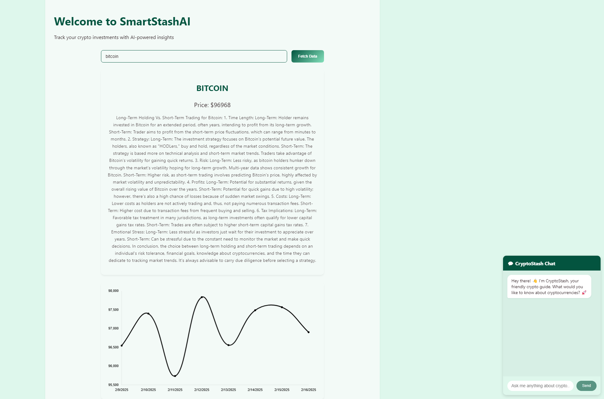
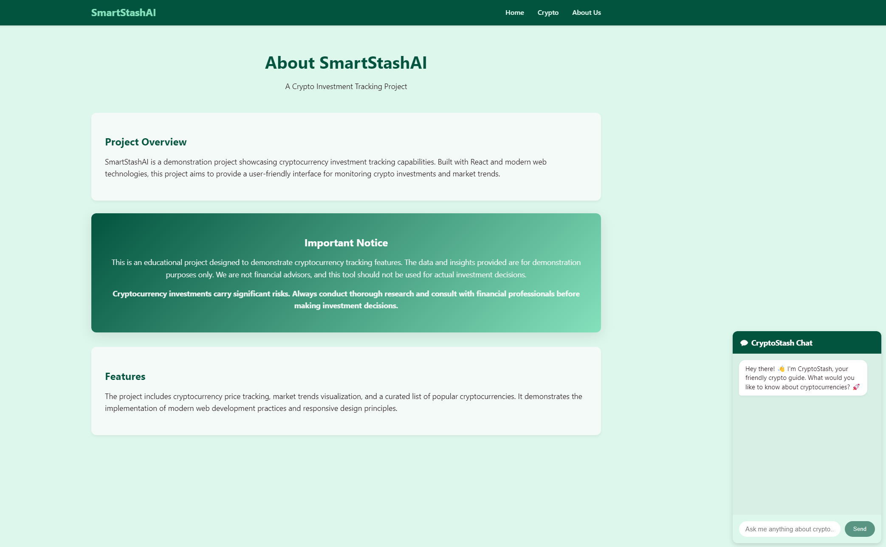
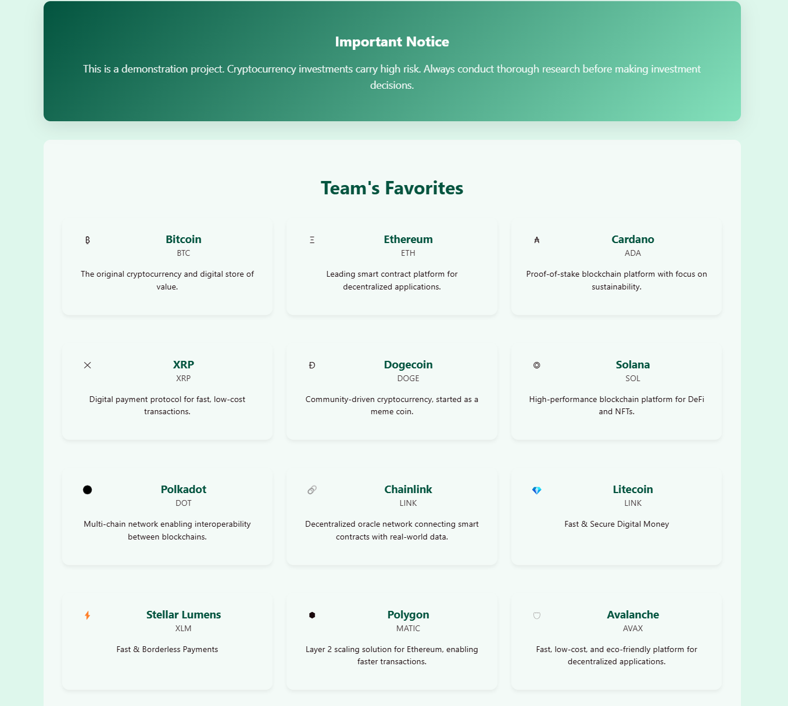

# 🚀 AI-Powered Crypto Tracker  

## 🏆 Hackathon Project
This project was developed as part of a hackathon, where we aimed to create an AI-driven financial tool that helps users track cryptocurrency prices, analyze investment opportunities, and receive AI-powered insights in real-time.

---

## 📌 Project Overview  
The **AI-Powered Crypto & Investment Tracker** is a smart tool that helps users **track cryptocurrency prices, analyze investment opportunities, and get AI-driven insights** based on real-time financial data. This project integrates **web scraping, AI processing, and financial analytics** to deliver actionable insights for investors.  

---

## 🎯 Key Features  
✔ **Crypto Price Tracking** – Fetches live cryptocurrency prices from **CoinGecko API**.  
✔ **AI-Powered Investment Insights** – Uses **OpenAI GPT-4** to analyze trends and suggest buy/sell actions.  
✔ **Real-Time Web Scraping** – Collects financial news & trends to keep investors informed.  
✔ **User-Friendly Dashboard** – Displays crypto trends in an **interactive React UI** with charts & alerts.  
✔ **Automated Alerts** – Notifies users when major price changes occur.  

---

## 🛠️ Tech Stack  
| **Component**        | **Technology**      |  
|----------------------|--------------------|  
| **Frontend**        | React (with Chart.js) |  
| **Backend**         | Flask (Python)      |  
| **Crypto Processing**    | CoinGecko API |  
| **AI Processing**   | OpenAI GPT-4 API    |  

---

## 🏗️ How It Works  
1️⃣ **User Enters a Crypto** – (e.g., Bitcoin, Ethereum, or Stocks).  
2️⃣ **Real-Time Data Fetching** – The system pulls live crypto prices from **CoinGecko API**.  
3️⃣ **AI-Generated Investment Insights** – OpenAI analyzes market trends & informs the user about long term holding vs. short term trading of said coin.  
4️⃣ **Dashboard Visualization** – Interactive **charts & tables** display recent trends.  
5️⃣ **AI-Powered Crypto Chatbot** – Ask questions to gain insights and guidance on cryptocurrency investments, market trends, and blockchain technology.  

---

## 📸 Screenshots

### 🏠 Dashboard Page  

### ℹ️ About Page  
 

## 🌙 Team Favorite Crypto

---

## 👥 Team  
- **Arthur Movsesyan**  
- **Islam Elsayed**  
